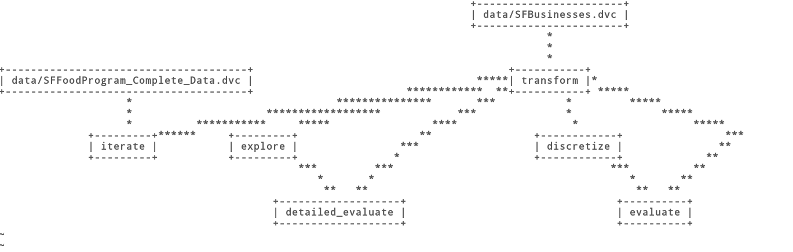

# Social Computing Assignment
Lab assignment for the Social Computing exam. This project is aimed to create a reproducible pipeline using _Data Version Control_ and the notebook [How clean are San Francisco's restaurants?](https://nbviewer.ipython.org/github/Jay-Oh-eN/happy-healthy-hungry/blob/master/h3.ipynb).

The notebbok aims to analyze the inspections of San Francisco restaurants using publicly data avaiable from the Department of Public Healt. 

The following pipeline is composed by the following stages:

### 1. Transform
In this stage we are going to merge the two datasets __businesses.csv__ and __inspections.csv__, then each row of the merged dataset is grouped by it's ID and by each group we extract the most reacent inspections based on its date. The resulting dataset is saved as __geolocated_rest.csv__, after removing the missing values of latitue and longitude. 

### 2. Explore
The aim of this stage is to extract the statistical values from the provious dataset.

### 3. Discretize
In this step we are going to calculate the needed information to evaluate our solution and hypothesis. Indeed, we are assigning discrete values of numerical scores of the dataset of inspections.

### 4. Evaluate
Using the previous metrics we can drawn some conclusions from our analysis, and from this first analysis we can conclude that most of the restaurants are evauated as __adequate__ and __good__ 

### 5. Detailed evaluate
Using the previous statistical indicators computed in the stage 2, we can drawn a more detailed evaluation of our analysis.

### 6. Iterate
This last step is aimed to analyze if there is or not a correlation between the score of each restaurant and the health violations.

## Setup
1. Download the repository and move to the folder:
```
git clone https://github.com/mrOranger/Social-Computing-Assignment
cd Social-Computing-Assignment
```

2. Create a new python environment:
```
python3 -m venv venv
```

3. Activate the new python environment:
If your are working on windows, the following command must be executed:
```
venv/Scripts/activate.bat
```
otherwise:
```
source venv/bin/activate
```

4. (Optional) Update pip package installer:
```
python -m pip install --upgrade pip
```

5. Install the dependencies using pip:
```
pip install -r src/requirements.txt
```

6. Pull data from the remote storage:
```
dvc pull
```

## Run
Run the pipeline using the command:
```
dvc repro --force
```

By using the command:
```
dvc dag
```
we can see the how the pipeline is distributed: 

### Notes
The following assignment has been developed by using __Python 3.8.5__ and __Debian 10__.
